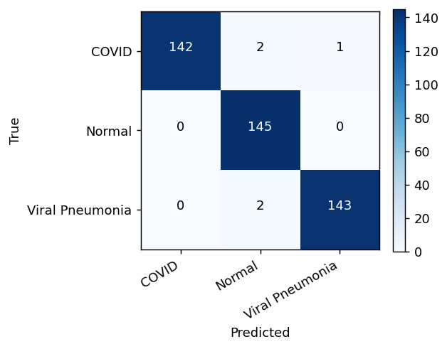
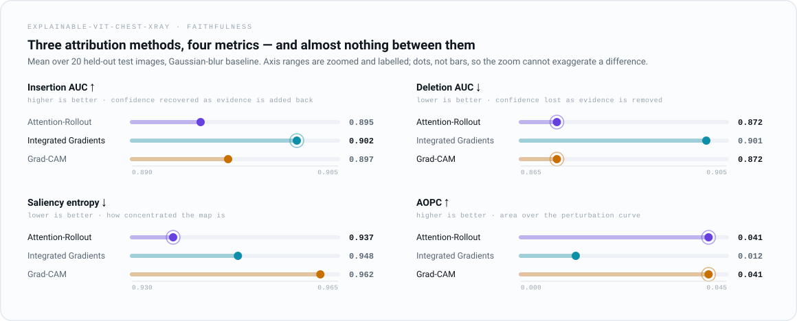
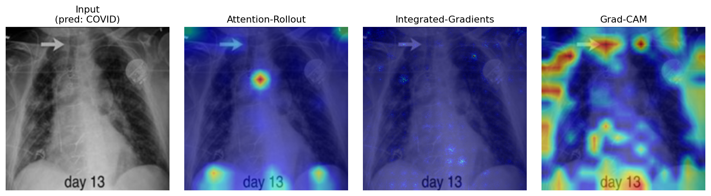
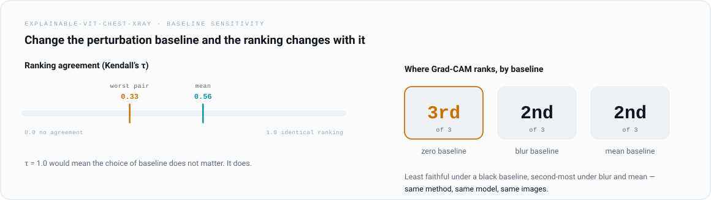
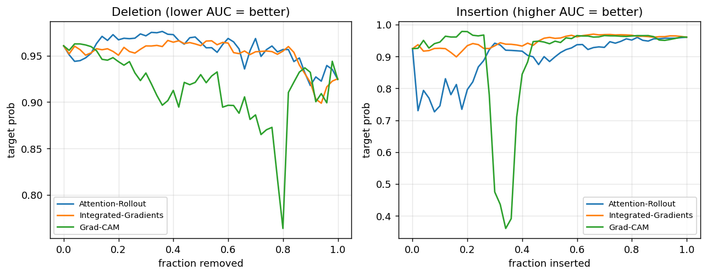

# Explainable Vision Transformer for Chest X-ray Diagnosis

> Beyond a single heatmap: training a ViT to classify COVID-19 / Normal / Viral Pneumonia, then **quantitatively measuring whether its explanations can be trusted.**

<p align="center">
  
  
  
  
  
</p>

<p align="center">
  <a href="https://colab.research.google.com/github/Parth-KG/explainable-vit-chest-xray/blob/main/notebook/notebook.ipynb">
    
  </a>
</p>

---

## Overview

This project was built for the **AIMS-DTU Research Intern 2026** selection round (Explainable Computer Vision track). It does two things most explainability demos skip:

1. **Trains a strong classifier** — a fine-tuned Vision Transformer (ViT-B/16) on a three-class chest X-ray task.
2. **Treats explainability as a measurable property, not a picture.** Three attribution methods are compared with three faithfulness metrics, and a bonus study asks the uncomfortable question: *do these metrics even agree with themselves?*

The headline finding is not the accuracy — it is that the three explanation methods **disagree on where the model looks**, the evaluation metrics **disagree on which explanation is best**, and faithfulness scores are **sensitive to an arbitrary implementation choice** (the perturbation baseline). In a clinical setting, that matters.

---

## Highlights

- **ViT-B/16** fine-tuned for COVID-19 / Normal / Viral Pneumonia classification.
- **Three explainability methods:** Attention-Rollout (ViT-native), Integrated Gradients, and Grad-CAM (adapted for transformers).
- **Three quantitative metrics:** Insertion/Deletion AUC, saliency Entropy, and AOPC (Area Over the Perturbation Curve).
- **Bonus research contribution:** a controlled study of how faithfulness scores shift under different perturbation baselines (zero / blur / mean), with ranking-stability measured by Kendall's tau.
- **Reproducible by design:** fixed seeds, an auto-detecting data loader (handles flat *or* pre-split datasets), a one-command pipeline, an end-to-end synthetic-data test, and a one-click Colab notebook.

---

## Results

> Held-out test set (435 images, balanced across the three classes).

| Metric | Accuracy | Precision (macro) | Recall (macro) | F1 (macro) |
|:------:|:--------:|:-----------------:|:--------------:|:----------:|
| **ViT-B/16** | **98.85%** | **98.87%** | **98.85%** | **98.85%** |

Per-class F1: COVID 98.95% · Normal 98.64% · Viral Pneumonia 98.96%. Only 5 of 435 test images are misclassified, with zero errors on the Normal class.

<p align="center">
  
</p>

### Do the explanations hold up?

<picture>
  <source media="(prefers-color-scheme: dark)" srcset="figures/faithfulness-dark.svg">
  <source media="(prefers-color-scheme: light)" srcset="figures/faithfulness-light.svg">
  
</picture>

Attention-Rollout and Grad-CAM are near-tied. Integrated Gradients wins insertion and produces the sparsest maps, but trails badly on AOPC. On a blur baseline there is no clear winner — which sets up the next result.

<details>
<summary>Exact values (mean over 20 test images, blur baseline)</summary>

<br>

| Method | Insertion ↑ | Deletion ↓ | Entropy ↓ | AOPC ↑ |
|:-------|:-----------:|:----------:|:---------:|:------:|
| Attention-Rollout    | 0.895 | **0.872** | **0.937** | **0.041** |
| Integrated Gradients | **0.902** | 0.901 | 0.948 | 0.012 |
| Grad-CAM             | 0.897 | **0.872** | 0.962 | **0.041** |

</details>

---

## What the maps actually look like

<p align="center">
  
</p>

<sub>A test image predicted COVID-19, with all three attribution methods. Generated by <code>python run.py explain</code>.</sub>

The three methods disagree about where the evidence is, which is the point of measuring faithfulness rather than eyeballing heatmaps. Integrated Gradients is sparse and scattered; Attention-Rollout picks a handful of focal points; Grad-CAM is diffuse and reaches the image borders.

**Look at the top-left of the Grad-CAM panel.** This X-ray carries burned-in annotations — a radiologist's arrow and a `day 13` timestamp — and Grad-CAM places some of its strongest activation directly on them. See [Limitations](#limitations--future-work).

---

## Baseline sensitivity

<picture>
  <source media="(prefers-color-scheme: dark)" srcset="figures/baseline-stability-dark.svg">
  <source media="(prefers-color-scheme: light)" srcset="figures/baseline-stability-light.svg">
  
</picture>

Perturbation metrics (Deletion, Insertion, AOPC) remove pixels by replacing them with a baseline — usually black. For an X-ray a black hole is an image the model has never seen, so part of the measured confidence drop reflects an *off-manifold input* rather than lost evidence (cf. ROAR, ROAD). This project recomputes AOPC under zero / blur / mean baselines and reports ranking agreement via Kendall's tau: **the ranking flips.** Grad-CAM is judged the *least* faithful under a black baseline and the *second-most* faithful under blur and mean, dropping tau to 0.33 for the worst pair (mean tau ≈ 0.56).

<p align="center">
  
</p>

<sub>Target-class probability as evidence is removed (left) and added back (right). The AUCs above are these curves integrated.</sub>

The curves show what the summary numbers hide: the three methods sit almost on top of each other across most of the range, and the AUC differences come from a few sharp excursions rather than a consistent gap. A faithfulness score is therefore meaningful only *within* a fixed, manifold-respecting baseline — which is why this repo defaults to a Gaussian-blur baseline and reports stability alongside the scores.

---

## Methods at a glance

| Method | Type | What it answers |
|:-------|:-----|:----------------|
| **Attention-Rollout** | ViT-native | How attention propagates from input patches to the classification token across all layers |
| **Integrated Gradients** | Model-agnostic attribution | Per-pixel contribution, integrated along a path from a baseline to the input |
| **Grad-CAM** | Gradient-weighted activations | Coarse, class-discriminative region the final block responds to |

| Metric | Direction | Measures |
|:-------|:---------:|:---------|
| **Insertion / Deletion** | ins ↑ / del ↓ | Faithfulness — does revealing/removing important pixels change the prediction? |
| **Entropy** | ↓ | Focus — is the saliency concentrated or diffuse? |
| **AOPC** | ↑ | Faithfulness — average confidence drop when most-relevant regions are perturbed |

---

## Quickstart

### Option A — Google Colab (recommended)

Open the notebook badge above, set the runtime to **GPU**, upload the dataset, and run the cells top to bottom. The loader auto-detects the dataset structure and prints it for you to confirm before training.

### Option B — Local

```bash
git clone https://github.com/Parth-KG/explainable-vit-chest-xray.git
cd explainable-vit-chest-xray
pip install -r requirements.txt

# point config.py's data_root at your dataset folder, then:
python run.py all          # train -> classify -> explain -> xai-eval -> bonus
```

Individual stages:

```bash
python run.py train        # fine-tune ViT, save best checkpoint
python run.py classify     # accuracy / precision / recall / F1 + confusion matrix
python run.py explain      # saliency overlays for sample images
python run.py xai-eval     # Insertion/Deletion, Entropy, AOPC table
python run.py bonus        # baseline ranking-stability experiment
```

No dataset handy? Every stage runs on generated data with `--synthetic`, and the full pipeline is covered by:

```bash
python -m tests.smoke_test
```

Synthetic runs are for checking the pipeline executes — the resulting saliency maps are noise and should not be read as results.

---

## Dataset

A three-class chest X-ray dataset (COVID-19, Normal, Viral Pneumonia). The data loader **auto-detects** the layout:

- **Flat** — `root/<Class>/(images/)*.png` -> a stratified 70/15/15 split is created.
- **Pre-split** — `root/{train,val,test}/<Class>/*.png` -> the provided split is used.

It also skips `__MACOSX`/hidden folders and drops a Lung-Opacity category if present, keeping the task to three classes. Trained weights and full-resolution outputs are hosted on Drive (link below) rather than committed to the repo.

---

## Repository structure

```
config.py                       # all hyperparameters & paths
run.py                          # CLI orchestrator
src/
  data.py                       # auto-detecting loader, transforms, synthetic data
  model.py                      # timm model build/save/load
  train.py                      # training loop + classification metrics
  explain.py                    # Attention-Rollout, Integrated Gradients, Grad-CAM
  evaluate_xai.py               # Insertion/Deletion, Entropy, AOPC (+ baselines)
  bonus.py                      # baseline ranking-stability study (Kendall's tau)
  visualize.py                  # report figures
tests/smoke_test.py             # end-to-end correctness test
notebook/                       # one-click Colab pipeline
figures/                        # figures used in this README
```

---

## Limitations & future work

Near-perfect accuracy on aggregated COVID X-ray datasets can reflect source-specific artifacts rather than pathology, so results are reported with that caveat.

The saliency figure above makes that caveat concrete rather than theoretical. Images in this dataset carry burned-in annotations, and Grad-CAM places strong activation on exactly those marks — an arrow and a `day 13` label — while giving comparatively little weight to the lung fields. Border activation appears across every sampled image. One example does not prove the classifier depends on annotation, and these attribution maps are not calibrated to establish that. But annotation style correlates with source and source correlates with label, so it is the first thing to rule out, not the last.

A further caveat on the qualitative figure: `run.py explain` samples the first images from the test loader, so all six happen to be COVID cases. A per-class strip would be more representative.

Natural next steps: validate saliency against the dataset's lung masks (IoU) to test the annotation hypothesis directly, add the sanity checks of Adebayo et al., implement a ROAD baseline, and scale the explainability evaluation across more images and seeds.

---

## References

Abnar & Zuidema (2020), *Quantifying Attention Flow*; Sundararajan et al. (2017), *Integrated Gradients*; Selvaraju et al. (2017), *Grad-CAM*; Petsiuk et al. (2018), *RISE*; Samek et al. (2017), *AOPC*; Hooker et al. (2019), *ROAR*; Rong et al. (2022), *ROAD*; Chowdhury et al. (2020) & Rahman et al. (2021), *COVID-19 Radiography Database*.

---

## Author

**Parth Krishan Goswami** — AIMS-DTU Research Intern 2026 submission.

Trained weights & figures: [Google Drive](https://drive.google.com/drive/folders/1AKIQr9OT8aGfAaBGH6ZRdoMhattxomjP?usp=sharing)

<sub>Released for evaluation purposes. Dataset © its original authors.</sub>
